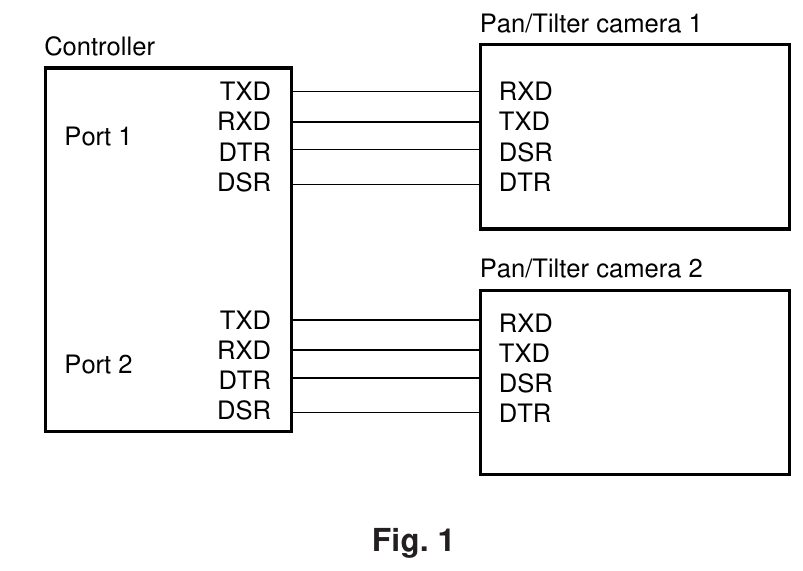
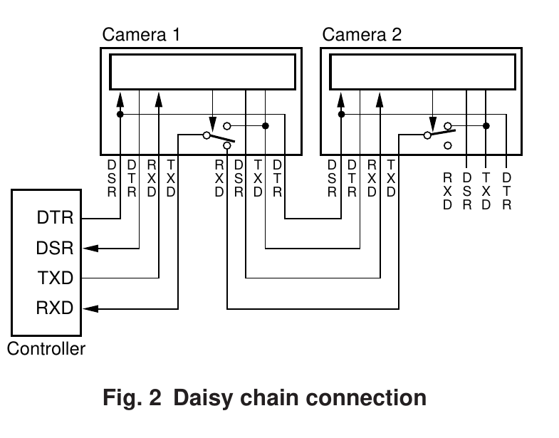

# COME FUNZIONA IN SERIALE

> [!info] NOTE SULLA CONSULTAZIONE
> In questo documento sono presenti termini tecnici e acronimi specifici del protocollo VISCA. Per facilitare la lettura, puoi cliccare sui termini evidenziati per saltare direttamente nel file **VISCA HOME** con spiegazione dettagliata nel paragrafo TERMINI RICORRENTI (in fondo al file).

## STANDARD DI CONNESSIONE

### [RS-232](https://it.wikipedia.org/wiki/EIA_RS-232)

**Da usare in stanza** (Short Range).

- **Distanza Max:** 15 metri.
- **Uso:** Collegamento diretto PC-Camera.

### [RS-422](https://it.wikipedia.org/wiki/EIA_RS-422)

**Da usare per lunghe distanze** (Long Range).

- **Distanza Max:** 1.2 KM.
- **Uso:** Collegamenti in grandi auditorium o stadi.

---

## Connessione e Topologia

### Dispositivi di controllo supportati

- PC (Personal Computer)
- Workstations
- Joystick Hardware dedicati

### Modalità di Connessione: Porta Dedicata vs Daisy Chain

| Tipologia di collegamento | **Modello 1 a 1** (Porta dedicata)                                      | **Modello a Cascata** (Daisy Chain)                                               |
| :------------------------ | :---------------------------------------------------------------------- | :-------------------------------------------------------------------------------- |
| **Schema**                |               |                   |
| **Cablaggio**             | Ogni telecamera va direttamente al controller.                          | Il controller va alla Camera 1, la 1 alla 2, e così via.                          |
| **Porte sul Controller**  | Ne serve una per ogni telecamera.                                       | Ne basta **una sola** per tutto il gruppo.                                        |
| **Vantaggi**              | Se un cavo si rompe, perdi solo una telecamera (Isolamento del guasto). | Grande risparmio di cavi se le telecamere sono lontane dal controller.            |
| **Svantaggi**             | Molto ingombrante se hai tante telecamere (molti cavi lunghi).          | Se si rompe il cavo della prima telecamera, perdi il controllo di tutta la serie. |
| **Limite Dispositivi**    | Limitato dal numero di porte fisiche.                                   | Fino a **7 dispositivi** per catena.                                              |

### DEFINIZIONI DEI TERMINI

- **Messaggio di ACK (Acknowledge):** Segnale inviato dalla telecamera al controller che conferma l'esecuzione di un comando, fornisce informazioni in risposta a una richiesta (inquiry) o segnala messaggi di errore.

- **Indirizzo (Address):** Identificativo assegnato automaticamente tramite il comando "address set". Alle telecamere viene assegnato un numero da 1 a 7. L'indirizzo del controller è fisso a 0.

- **Pacchetto (Packet):** L'unità fondamentale della comunicazione tra controller e telecamere. È composto da un Header (1 byte), dal Messaggio vero e proprio (massimo 14 byte) e da un Terminatore (1 byte; valore fisso `FF`).

- **Socket:** Memorie buffer della telecamera predisposte per accettare più di un comando contemporaneamente. Il numero di socket disponibili è solitamente **due**.

---

## Specifiche di Comunicazione (Livello Fisico)

Affinché la comunicazione avvenga, la porta COM deve rispettare questi parametri rigorosi:

| Parametro        | Valore Standard (VISCA) | Note                                                 |
| :--------------- | :---------------------- | :--------------------------------------------------- |
| **Standard**     | **RS-232C**             |                                                      |
| **Baud Rate**    | **9600 bps**            | (Verificare manuale camera, alcune supportano 38400) |
| **Start bit**    | **1**                   |                                                      |
| **Stop bit**     | **1**                   |                                                      |
| **Data bits**    | **8**                   |                                                      |
| **Parity**       | **None**                | Nessuna parità                                       |
| **Flow Control** | **None**                | No RTS/CTS                                           |

> [!warning] Ordine dei Bit (MSB vs LSB)
> Sebbene lo standard RS-232 classico preveda solitamente il **LSB first** (Least Significant Bit), la specifica VISCA richiede attenzione all'ordine dei byte (Big Endian). Assicurati che l'hardware o la libreria software utilizzata sia configurata correttamente per inviare i dati nell'ordine che la telecamera si aspetta.

---

> [!tip] Approfondimento Pacchetti
> Per i dettagli sulla composizione esadecimale, visualizzare la pagina dedicata: **[Struttura_del_pacchetto_VISCA](Struttura_del_pacchetto_VISCA.md)**

---

## Gestione della Rete (Daisy Chain)

A differenza dei sistemi IP dove ogni dispositivo ha un'identità pre-assegnata, nella seriale l'identità è determinata dalla **posizione fisica** nella catena.

### Procedura di Auto-assegnazione (Address Set)

All'accensione, le telecamere sono in uno stato "neutro". Il controller deve eseguire la procedura di **Address Set** per mappare la rete.

- **Il Comando:** `88 30 01 FF`

**La Logica di Propagazione:**

1. Il Controller invia `88 30 01 FF`.
2. La **Camera 1** riceve il pacchetto. Legge il valore `01`, lo assume come proprio indirizzo e lo memorizza.
3. La **Camera 1** modifica il pacchetto: trasforma lo `01` in `02` e lo invia sulla sua porta di uscita (VISCA OUT).
4. La **Camera 2** riceve `88 30 02 FF`, si assegna l'indirizzo `02`, lo incrementa a `03` e lo passa oltre.
5. L'ultima camera della catena rimanda il pacchetto finale al Controller.
6. Il Controller capisce, tramite l'indirizzo di ritorno, quante telecamere esistono nella catena.

> [!IMPORTANT] Hot-Swap non supportato
> Se aggiungi o rimuovi una telecamera dalla catena mentre il sistema è acceso, l'intera numerazione potrebbe saltare o bloccarsi. È regola d'oro inviare sempre un nuovo comando di **Address Set** (`88 30 01 FF`) dopo ogni modifica fisica al cablaggio.
