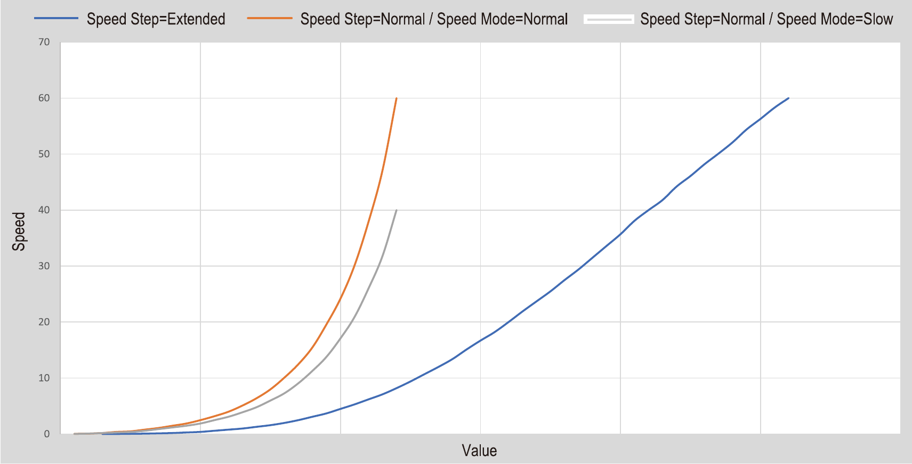

# Guida allo Sviluppo di un Controller VISCA

Questa sezione delinea i passaggi logici fondamentali per implementare il protocollo nel codice sorgente, garantendo che la comunicazione sia robusta e che i comandi vengano eseguiti senza perdite di dati o blocchi hardware.

> [!tip] Implementazione Python
> Se sviluppi in Python, l'architettura deve essere **Asincrona** o **Multi-thread**:
>
> 1. **Thread Video:** Ciclo infinito che legge lo stream RTSP e aggiorna il canvas della UI.
> 2. **Thread Comandi:** Gestisce l'invio dei pacchetti UDP e l'ascolto dei messaggi di ritorno (ACK/Completion).

## Architettura a Due Code (Gestione Socket)

Dalla documentazione tecnica emerge che la telecamera dispone di **due socket** di memoria per l'esecuzione dei comandi. Lo sviluppo deve riflettere questa realtà per permettere movimenti fluidi.

- **Logica dei Socket:** Il software deve monitorare lo stato di occupazione. Un comando occupa un socket alla ricezione dell'ACK (`z0 4y FF`) e lo libera solo alla ricezione della Completion (`z0 5y FF`).
- **Prevenzione del Buffer Full:** Se entrambi i socket sono occupati, il software deve inibire l'invio o accodare i comandi. Questo evita l'errore di Buffer Full (`z0 60 03 FF`).

## Algoritmo Nibble Parting (Integrità dei Dati)

Per la trasmissione di dati posizionali (Zoom, Pan, Tilt), VISCA impone lo spacchettamento dei dati in **4-bit nibbles** (schema `0p 0q 0r 0s`).

- **Finalità Tecnica:** Impedisce la generazione accidentale del valore `FF` (Fine Messaggio) all'interno dei dati, che causerebbe l'interruzione prematura della lettura del comando.
- **Implementazione Bitwise:** La conversione deve essere gestita tramite operatori di shift e maschere bitwise per garantire precisione.

## Gestione del Sequence Number e Reset (IP)

Nelle implementazioni VISCA over IP, il Sequence Number è l'identificativo cronologico del pacchetto UDP.

- **Comando di RESET (02 00):** Obbligatorio all'apertura della sessione per sincronizzare il contatore del controller con quello della camera sullo zero.
- **Sincronizzazione di Emergenza:** In caso di timeout prolungati, inviare un pacchetto di Reset per ripristinare il flusso.

## Lunghezza Variabile e Terminatore FF

Il protocollo VISCA è **rigidamente a lunghezza variabile**. Non bisogna mai forzare i pacchetti a una lunghezza fissa.

- **Il ruolo di FF:** La telecamera interrompe la lettura non appena incontra `FF`. Tutto ciò che segue è considerato l'inizio di un nuovo messaggio.
- **No Zero-Padding:** Non riempire mai i buffer di invio con `00` dopo il terminatore.
  - *Esempio Errato:* `81 01 04 07 02 FF 00 00` -> La camera eseguirà lo Zoom, ma leggerà gli `00` successivi come un comando non valido, restituendo un **Syntax Error (z0 6y 02)**.
- **Regola:** Il buffer di trasmissione deve corrispondere esattamente al numero di byte del comando specifico (da 5 a 14 byte).

## Gestione della Velocità e Risoluzione

I comandi di movimento utilizzano **24 Step** (da `01h` a `18h`). La modalità impostata cambia la mappatura dei motori.

| **Profilo Utente** | **Speed Step Mode** | **Range Hex** | **Risultato Meccanico** |
| :--- | :--- | :--- | :--- |
| **Precisione / Macro** | Slow | `01h` - `18h` | Movimenti fluidi (0-40°/s), precisione millimetrica. |
| **Standard / Studio** | Normal | `01h` - `18h` | Bilanciamento tra reattività e velocità (0-60°/s). |
| **Rapido / Sport** | Normal | `0Ah` - `18h` | Reattività massima per inseguimento soggetti veloci. |

> [!note] Valori Empirici
> I valori di velocità (°/s) indicati sono **empirici e testati internamente** su telecamere Sony EVI-H100S, EVI-D100P, e BRC-X400.
> La risposta meccanica varia a seconda del modello di camera, calibrazione dei motori, e carico meccanico.
> Consultare sempre il manuale tecnico della camera specifica per confermare i range di velocità supportati.

> [!tip] Ottimizzazione Motori
> Il software deve "preparare" la camera: se l'utente sceglie un profilo "Cinematic", inviare prima il comando `81 01 06 44 01 FF` (Set Slow Mode) per ottimizzare la curva di risposta dei motori.



**Figura 1:** Curve di accelerazione per i profili di velocità (Slow vs Normal). La curva Slow (blu) offre transizioni fluide con controllo preciso (0-40°/s), mentre Normal (rosso) bilancea reattività e velocità (0-60°/s). Le curve esponenziali per Sport (verde) richiedono step maggiori (0Ah+) per massimizzare la reattività.

## Interpretazione Feedback e Diagnostica (I "Mezzi Byte")

Le risposte della camera utilizzano segnaposto indicati come **p, q, r, s**. Questi sono **Nibbles** (4 bit / mezzo byte / 1 cifra esadecimale).

### Logica dei Bit di Stato (Pan/Tilt Status)

Per leggere lo stato, il codice deve isolare i singoli bit del nibble tramite una maschera bitwise:

| **Nibble / Bit** | **Stato Meccanico** | **Significato per lo Sviluppatore** |
| :--- | :--- | :--- |
| **p (bit 0 = 1)** | Fine Corsa (Limit) | Camera bloccata fisicamente. Inibire input direzione. |
| **p (bit 1-2)** | Operating / Complete | `01`: In movimento. `10`: Operazione completata. |
| **p (bit 3 = 1)** | Mechanism Defective | Guasto hardware. Segnalare errore critico. |

#### Esempio di Parsing (Bitmasking in JS)

```javascript
let responseByte = readFromCamera(); 
let p_low = responseByte & 0x0F; // Isola l'ultimo nibble (0x0F = 00001111)

if (p_low === 0x01) {
    // Logica per gestire il limite raggiunto
    console.log("Attenzione: Fine corsa raggiunto");
}
```

## Gestione degli Errori e Asincronia

Per la codifica completa dei messaggi di errore, vedi [VISCA Protocol - Quick Reference & Troubleshooting Guide](VISCA%20Protocol%20-%20Quick%20Reference%20%26%20Troubleshooting%20Guide.md#codici-errore-estesi).

Errori critici nel flusso sviluppo:

|**Codice**|**Significato**|**Azione Software**|
|---|---|---|
|**z0 60 01**|Lunghezza messaggio errata|Verificare conteggio byte del pacchetto VISCA.|
|**z0 60 02**|Syntax Error|Controllare formattazione byte, padding superfluo dopo FF, o header malformato.|
|**z0 60 03**|Command Buffer Full|Attendere Completion di un socket prima di inviare nuovo comando.|
|**z0 6y 41**|Not Executable|Comando valido ma camera occupata, in standby, o limite raggiunto.|
|**Timeout**|Pacchetto Perso|Esecuzione Reset della sessione IP e ricerca della camera.

## Strategia di Sviluppo Modulare

1. **Modulo Basso Livello:** Gestione Socket UDP/Seriale e invio byte grezzi.

2. **Modulo Network Manager:** Gestione Sequence Number e Reset.

3. **Modulo Logico (Visca Manager):** Gestione stato socket e interpretazione ACK/Completion/Nibbles di stato.

4. **Modulo Comandi:** Astrazione delle funzioni operative (Muovi, Zoom) e conversione Nibble Parting.

## Architettura del Software: Il Modello a Due Canali

Per creare un controller professionale che includa il ritorno video, il software deve operare su due canali paralleli e indipendenti. Se i two canali non fossero separati, il movimento della telecamera (latenza di rete) bloccherebbe il video, o viceversa.

### Gestione Asincrona (Multithreading)

Indipendentemente dal linguaggio scelto, l'applicazione deve gestire i carichi di lavoro in thread o processi distinti:

- **Canale A: Ritorno Video (Stream RTSP)**

  - **Compito:** Ricevere i pacchetti video dalla telecamera, decodificarli e renderizzarli a video.

  - **Criticità:** È un processo ad alto consumo di CPU. Non deve mai attendere le risposte del protocollo VISCA per aggiornare il frame successivo.

  - **Obiettivo:** Latenza minima (Glass-to-Glass latency).

- **Canale B: Controllo Meccanico (VISCA over IP)**

  - **Compito:** Inviare comandi UDP e "ascoltare" i messaggi di ACK/Completion e i **Nibbles di stato**.

  - **Criticità:** È un processo a basso consumo di banda ma richiede precisione nel timing.

  - **Obiettivo:** Gestione dei due socket senza saturare il buffer della camera.

### Diagramma di Flusso Universale

Ecco come i due canali interagiscono nella UI:

1. **Input Utente:** L'utente muove un joystick o preme un tasto sulla UI.

2. **Thread Comandi:** Intercetta l'input, costruisce il pacchetto HEX (es. `81 01 06 01 VV WW ...`) e lo invia.

3. **Thread Video:** Continua a renderizzare i frame RTSP indipendentemente dall'invio del comando.

4. **Feedback Visivo:** Il Thread Comandi riceve i bit di stato (es. "Limit reached") e invia un segnale alla UI per disegnare un avviso grafico sopra il video.

### Suggerimenti Tecnologici

|**Ambito**|**Soluzione Consigliata**|
|---|---|
|**Video (Bassa Latenza)**|RTSP via OpenCV (Python) o JSMpeg/WebRTC (JS).|
|**Sincronizzazione**|Utilizzare variabili "Flag" o code (Queue) per passare informazioni tra il thread video e quello dei comandi.|
|**Interfaccia (UI)**|Framework che supportano l'aggiornamento dinamico (PyQt, React, Electron, Flutter).|

## Validazione del Dispositivo (Protocol Handshake)

Affidarsi esclusivamente al test "Porta Aperta" (Socket Connect su 52381) espone il sistema a **Falsi Positivi**. Dispositivi consumer (Console di gioco, Smart TV, Stampanti) possono avere porte UDP alte aperte per servizi proprietari (UPnP, DLNA).

Per certificare che l'IP target sia effettivamente una telecamera PTZ ed evitare di inviare comandi di movimento a una PlayStation, è necessario implementare il **VISCA 3-Way Handshake**.

### L'Algoritmo di Validazione

Il software non deve mai assumere che un IP sia una telecamera. Deve verificarlo attivamente prima di abilitare i controlli UI.

1. **Fase 1: Network Reachability (Livello 3)**

    - Ping ICMP verso l'IP. Se risponde, procedere.

2. **Fase 2: Port Reachability (Livello 4)**

    - Tentativo di connessione UDP sulla porta `52381`. Se accettata, procedere.

3. **Fase 3: Protocol Compliance (Livello 7 - CRITICO)**

    - Inviare un comando di **Inquiry (Richiesta Informazioni)** innocuo.

    - **Payload Inviato (Get Version):**

        `01 00 00 05 00 00 00 01 81 09 00 02 FF`

        *(Header IP + Sequence #1 + VISCA Inquiry Version)*

    - **Analisi della Risposta:**

        Il software deve parsare la risposta esadecimale.

        - **Check A:** La risposta inizia con `01 00`? (Conferma Header VISCA-over-IP).

        - **Check B:** Il payload VISCA inizia con `90 50`? (Conferma "Reply from Camera" + "Completion Inquiry").

**Tabella Decisionale:**

|**Risposta Ricevuta**|**Analisi Tecnica**|**Azione Software**|
|---|---|---|
|**Nessuna (Timeout)**|Porta aperta ma protocollo sconosciuto.|**Scartare** (Probabile Firewall/PC).|
|**Dati Random**|Protocollo non conforme.|**Scartare** (Probabile Console/IoT).|
|**`01 00 ... 90 50 ...`**|Handshake VISCA confermato.|**Accettare** e Abilitare UI.|

## Strategia "Self-Healing": Tracciamento MAC Address

Per mitigare i rischi derivanti da cambi IP imprevisti (DHCP) o spostamenti fisici delle telecamere, il controller non deve legare l'identità della camera al suo indirizzo IP, ma al suo **MAC Address (Media Access Control)**.

### Algoritmo di Riconnessione Automatica

Il sistema deve mantenere un registro persistente (Database/JSON) delle associazioni `MAC <-> Ultimo IP Noto`.

**Procedura di Recupero:**

1. **Connection Loss:** Se la telecamera all'IP `X` non risponde (Ping Timeout o Socket Error), il software non dichiara subito la camera "Offline".

2. **ARP Flush & Scan:** Il software lancia una scansione rapida della sottorete (es. invio di pacchetti UDP/Ping broadcast) per forzare l'aggiornamento della tabella ARP del sistema operativo.

3. **MAC Search:** Il software interroga la tabella ARP locale cercando il MAC Address univoco della telecamera scomparsa.

4. **IP Update:**

    - **Se trovato:** Il nuovo IP associato al MAC viene salvato nel database. La connessione VISCA viene riaperta sul nuovo indirizzo in modo trasparente.

    - **Se non trovato:** Solo ora viene mostrato l'errore "Camera Disconnected" all'operatore.

> **Vantaggio Operativo:** Questa architettura rende il sistema resiliente al riavvio dei router o alla scadenza dei lease DHCP, eliminando la necessità di riconfigurazione manuale da parte dei tecnici.

---

## Esempi di Codice Completi

> [!WARNING] **DISCLAIMER - Codice Concettuale**
> I codici seguenti illustrano i principi architetturali e flussi logici del protocollo VISCA.
> **Non sono codice production-ready**. Per uso in ambienti di produzione:
> - Aggiungere gestione errori completa e retry logic
> - Implementare logging/monitoring robusto
> - Eseguire extensive testing su hardware specifico
> - Verificare compliance alle specifiche VISCA della camera target
> - Consultare sempre la documentazione del produttore

### Python - Classe VISCA Controller Completa

``` python

import socket
import threading
import time
from dataclasses import dataclass
from enum import Enum
from typing import Optional

class ViscaCommandType(Enum):
    COMMAND = 0x01
    INQUIRY = 0x09
    NETWORK = 0x00

class ViscaController:
    def __init__(self, ip: str, port: int = 52381):
        self.ip = ip
        self.port = port
        self.sequence_number = 1
        self.socket = socket.socket(socket.AF_INET, socket.SOCK_DGRAM)
        self.socket.settimeout(2.0)
        self.socket_lock = threading.Lock()
        # Nota: Gestione socket implementata nella classe ViscaStateMachine
        
    def send_command(self, command_hex: str) -> Optional[bytes]:
        """Invia comando VISCA over IP"""
        # Aggiungi header IP
        payload_type = bytes([0x01, 0x00])  # Command
        payload_len = len(bytes.fromhex(command_hex.replace(" ", "")))
        payload_len_bytes = payload_len.to_bytes(2, 'big')
        seq_num_bytes = self.sequence_number.to_bytes(4, 'big')
        
        ip_header = payload_type + payload_len_bytes + seq_num_bytes
        command_bytes = bytes.fromhex(command_hex.replace(" ", ""))
        full_packet = ip_header + command_bytes
        
        with self.socket_lock:
            try:
                self.socket.sendto(full_packet, (self.ip, self.port))
                self.sequence_number += 1
                
                # Attendi risposta
                response, _ = self.socket.recvfrom(1024)
                return response
            except socket.timeout:
                return None
                
    def reset_sequence(self):
        """Resetta sequence number"""
        reset_packet = bytes([0x02, 0x00, 0x00, 0x00, 0x00, 0x00, 0x00, 0x00])
        with self.socket_lock:
            self.socket.sendto(reset_packet, (self.ip, self.port))
            self.sequence_number = 1

    def move_pan_tilt(self, pan_speed: int, tilt_speed: int, pan_dir: int, tilt_dir: int):
        """Muovi Pan/Tilt con velocità e direzione"""
        # Validazione parametri
        pan_speed = max(1, min(24, pan_speed))
        tilt_speed = max(1, min(20, tilt_speed))
        
        command = f"81 01 06 01 {pan_speed:02X} {tilt_speed:02X} {pan_dir:02X} {tilt_dir:02X} FF"
        return self.send_command(command)
```

### State Machine per Gestione Socket

``` python

class ViscaState(Enum):
    IDLE = "idle"
    WAITING_ACK = "waiting_ack"
    EXECUTING = "executing"
    ERROR = "error"

class ViscaStateMachine:
    def __init__(self):
        self.state = ViscaState.IDLE
        self.socket_states = {1: ViscaState.IDLE, 2: ViscaState.IDLE}
        
    def process_response(self, response_hex: str, socket_num: int):
        """Processa risposta e aggiorna stato"""
        if response_hex.endswith("4y FF"):  # ACK
            self.socket_states[socket_num] = ViscaState.WAITING_ACK
        elif response_hex.endswith("5y FF"):  # Completion
            self.socket_states[socket_num] = ViscaState.IDLE
        elif "60" in response_hex:  # Errore
            self.socket_states[socket_num] = ViscaState.ERROR
            
    def can_send_command(self) -> bool:
        """Verifica se c'è un socket disponibile"""
        return any(state == ViscaState.IDLE for state in self.socket_states.values())
```

### Logging Strutturato

``` python

import logging
import json
from datetime import datetime

class ViscaLogger:
    def __init__(self, camera_ip: str):
        self.camera_ip = camera_ip
        logging.basicConfig(
            filename=f'visca_{camera_ip.replace(".", "_")}.log',
            level=logging.DEBUG,
            format='%(asctime)s - %(levelname)s - %(message)s'
        )
        
    def log_command(self, command_hex: str, response_hex: Optional[str], success: bool):
        """Logga comando e risposta"""
        log_entry = {
            'timestamp': datetime.now().isoformat(),
            'camera_ip': self.camera_ip,
            'command': command_hex,
            'response': response_hex,
            'success': success,
            'sequence_number': self.controller.sequence_number if hasattr(self, 'controller') else None
        }
        
        logging.info(json.dumps(log_entry))
        
        if not success:
            logging.error(f"Command failed: {command_hex}")
```

### Gestione Timeout Adattiva

```python

class AdaptiveTimeout:
    def __init__(self, initial_timeout: float = 2.0):
        self.base_timeout = initial_timeout
        self.current_timeout = initial_timeout
        self.success_count = 0
        self.failure_count = 0
        
    def update(self, success: bool):
        """Aggiorna timeout in base al successo"""
        if success:
            self.success_count += 1
            self.failure_count = max(0, self.failure_count - 1)
            # Riduci timeout se stabile
            if self.success_count > 10:
                self.current_timeout = max(0.5, self.current_timeout * 0.9)
        else:
            self.failure_count += 1
            self.success_count = 0
            # Aumenta timeout in caso di errori
            if self.failure_count > 3:
                self.current_timeout = min(10.0, self.current_timeout * 1.5)
                
    def get_timeout(self) -> float:
        return self.current_timeout
```

### Pattern Producer-Consumer per Comandi

```python

from queue import Queue
import threading

class ViscaCommandQueue:
    def __init__(self, controller):
        self.controller = controller
        self.command_queue = Queue()
        self.processing = False
        self.worker_thread = threading.Thread(target=self._process_queue, daemon=True)
        
    def add_command(self, command_hex: str, callback=None):
        """Aggiunge comando alla coda"""
        self.command_queue.put((command_hex, callback))
        
    def start(self):
        """Avvia processing della coda"""
        self.processing = True
        self.worker_thread.start()
        
    def stop(self):
        """Ferma processing della coda"""
        self.processing = False
        self.worker_thread.join()
        
    def _process_queue(self):
        """Worker thread che processa la coda"""
        while self.processing:
            try:
                command_hex, callback = self.command_queue.get(timeout=0.1)
                response = self.controller.send_command(command_hex)
                if callback:
                    callback(response)
                self.command_queue.task_done()
            except Queue.Empty:
                continue
```

## Best Practices Sviluppo

### 1. Gestione Errori Robusta

- Implementare retry automatico per timeout

- Validare risposte prima di processarle

- Loggare tutti gli errori con contesto

### 2. Performance e Scalabilità

- Usare connection pooling per molte telecamere

- Implementare batch commands quando possibile

- Monitorare memoria e CPU in runtime

### 3. Sicurezza

- Validare input utente per prevenire injection

- Implementare rate limiting

- Loggare tentativi di accesso non autorizzati

### 4. Manutenibilità

- Documentare API interne

- Usare type hints e docstring

- Implementare test unitari per moduli critici

---

## Deployment Checklist

### Pre-Produzione

- Testare con almeno 5 telecamere simultanee

- Verificare memoria < 100MB per camera

- Testare recovery da crash di rete

- Validare log rotation e management

### In Produzione

- Monitorare packet loss (< 0.1%)

- Alert su sequence number mismatch

- Backup configurazione automatico

- Health check periodico dispositivi

### Manutenzione

- Aggiornare firmware telecamere

- Verificare certificati SSL (se usati)

- Revisione log per anomalie

- Test failover procedure
