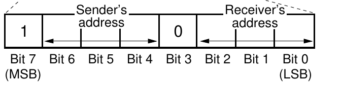
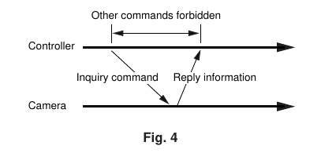
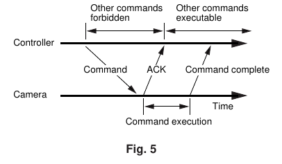
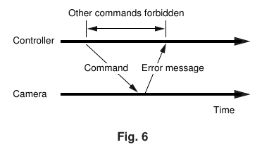
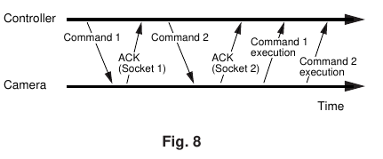
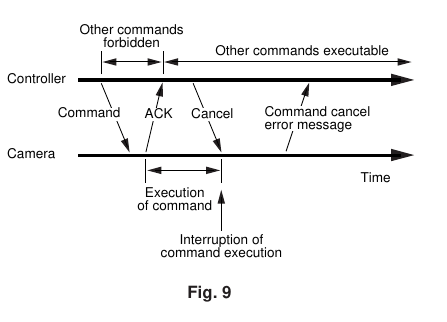

# Struttura del pacchetto VISCA

> [!info] NOTE SULLA CONSULTAZIONE
> In questo documento sono presenti termini tecnici e acronimi specifici del protocollo VISCA. Per facilitare la lettura, puoi cliccare sui termini evidenziati per saltare direttamente nel file **VISCA HOME** con spiegazione dettagliata nel paragrafo TERMINI RICORRENTI (in fondo al file).

La struttura standard di un pacchetto inviato dal controller segue questo schema sequenziale:

## COMUNICAZIONE DAL CONTROLLER

| **Componente** | **Dimensione** | **Descrizione** |
| :--- | :--- | :--- |
| **Header** | 1 Byte | Contiene gli indirizzi di mittente e destinatario (es. `8x`). |
| **Message** | Fino a 14 Byte | Il corpo del comando, suddiviso in modalità, categoria e parametri. |
| **Terminator** | 1 Byte | Indica la fine del pacchetto (sempre `FF`). |

### HEADER

> [!warning] Attenzione: Header Seriale
> Questo è l'HEADER PER LA PARTE SERIALE. Per la parte OVER IP, consultare il file dedicato: **[VISCA_SOPRA_IP](VISCA_SOPRA_IP.md)**.

Il messaggio inizia con un header di 1 byte composto da queste parti:

| **N BIT** | **Compito** | **Note Tecniche** |
| :--- | :--- | :--- |
| **Bit 7** | **MSB** | Identifica l'inizio del messaggio (fisso a **1**). |
| **Bit 6** | **Mittente (Bit 2)** | Valore $2^2$ dell'indirizzo di chi invia il comando. |
| **Bit 5** | **Mittente (Bit 1)** | Valore $2^1$ dell'indirizzo di chi invia il comando. |
| **Bit 4** | **Mittente (Bit 0)** | Valore $2^0$ dell'indirizzo di chi invia il comando. |
| **Bit 3** | **Separatore** | Fisso a **0**; funge da divisore logico tra i due indirizzi. |
| **Bit 2** | **Destinatario (Bit 2)** | Valore $2^2$ dell'indirizzo di chi riceve il comando. |
| **Bit 1** | **Destinatario (Bit 1)** | Valore $2^1$ dell'indirizzo di chi riceve il comando. |
| **Bit 0** | **LSB** | Valore $2^0$ del destinatario. Bit meno significativo dell'intero byte. |

### MESSAGE

**Dimensione Massima:** 14 byte

| **Byte nel Message** | **Nome Tecnico** | **Funzione** |
| :--- | :--- | :--- |
| **1° Byte** | **COM-MODE** | **Intento** (Tipo di comando) |
| **2° Byte** | **CATEGORIA** | **Reparto** (Es. Camera, Interfaccia) |
| **3° Byte** | **Sub-Code** | **Azione** (Operazione specifica, es. `02` Pan Absolute). |
| **dal 4° al 14°** | **PARAMETRI** | **Dati** (Velocità, coordinate, ecc. Qui si "consumano" i byte restanti). |

#### COM-MODE

Stabilisce a cosa serve il comando:

| **Codice (Hex)** | **Tipo di Messaggio** | **Descrizione** |
| :--- | :--- | :--- |
| **01H** | **Command** | Per inviare ordini operativi (azione). |
| **09H** | **Inquiry** | Per interrogare lo stato della camera (domanda). |
| **00H** | **Net-keeping** | Per la gestione della rete (indirizzi) o interfaccia. |

#### CATEGORIA

Identifica l'hardware target: es. `04` per le telecamere (Camera1), `06` per periferiche Pan-Tilt.

#### PARAMETRI

Contiene velocità, coordinate o stati.

| **Tipo di Dato** | **Utilizzo dei Byte** | **Descrizione** |
| :--- | :--- | :--- |
| **Velocità (VV/WW)** | 1 o 2 Byte | Definisce la rapidità. `VV`=Pan, `WW`=Tilt. Range: `01` (lento) a `18`/`14` (max). |
| **Stati (Switch)** | 1 Byte | Byte binari o scelta singola. Es: `02`=**ON**, `03`=**OFF**, `10`=**Auto**. |
| **Dati Posizionali** | 4 Byte per asse | Per inviare posizioni (Zoom/Pan), il valore è spezzato in 4 nibbles. |

#### TERMINATOR

Valore fisso: **FF** (Esadecimale). Chiude il pacchetto.

---

## FLUSSO DELLA COMUNICAZIONE

| **Caso**                          | **Diagramma**                                                 | **Descrizione Logica**    | **Comportamento**                                                                                     |
| :-------------------------------- | :------------------------------------------------------------ | :------------------------ | :---------------------------------------------------------------------------------------------------- |
| **Inquiry (Fig. 4)**              |          | Domanda immediata.        | La camera risponde subito con l'informazione. Non serve ACK.                                          |
| **Command (Fig. 5)**              |          | Azione differita.         | Il controller invia il comando -> riceve ACK -> attende fine azione -> riceve Completion.             |
| **Errore Immediato (Fig. 6)**     |  | Comando non valido.       | La camera risponde subito con un messaggio di Errore invece dell'ACK.                                 |
| **Errore in Esecuzione (Fig. 7)** |  | Fallimento post-partenza. | La camera invia ACK, ma durante l'esecuzione riscontra un problema e invia Errore (no Completion).    |
| **Esecuzione Multipla (Fig. 8)**  |    | Due comandi insieme.      | È possibile inviare un secondo comando prima che il primo sia finito, purché ci sia un socket libero. |
| **Cancel (Fig. 9)**               |           | `z0 6y 04 FF`             | Invia Cancel durante l'azione -> Socket liberato -> Azione interrotta.                                |
| **No Socket (Fig. 10)**           |        | `z0 60 05 FF`             | Invia Cancel ad azione già finita -> Socket era già libero.                                           |
| **Stop Info (Fig. 11)**           |            | Stop invio Info           | Invia Cancel a flusso dati -> Flusso interrotto con successo.                                         |

> [!warning] Gestione della Lunghezza Variabile (No Padding)
> Il protocollo VISCA è un protocollo a **lunghezza variabile**. A differenza di altri protocolli industriali che richiedono pacchetti di dimensione fissa, VISCA interpreta il byte `FF` come l'ordine categorico di interrompere la lettura.
---
> [!success] PROSSIMI PASSI
>
> - **Evoluzione su Rete:** Consulta **[VISCA Sopra IP](VISCA_SOPRA_IP.md)** per scoprire come la struttura del pacchetto viene incapsulata in Header UDP e come cambia la gestione della porta 52381.
> - **Configurazione Fisica:** Consulta **[PARTE SERIALE](COME_FUNZIONA_IN_SERIALE.md)** per i dettagli su cablaggio RS-232, Daisy Chain e indirizzamento automatico.
> - **Implementazione nel codice:** Vai a **[Sviluppo](Guida_allo_Sviluppo_di_un_Controller_VISCA.md)** per i codici operativi di movimento e la gestione delle velocità.
