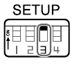

# VISCA over IP: Specifiche di Rete

> [!info] NOTE SULLA CONSULTAZIONE
> In questo documento sono presenti termini tecnici e acronimi specifici del protocollo VISCA. Per facilitare la lettura, puoi cliccare sui termini evidenziati per saltare direttamente al file **[VISCA HOME](VISCA_HOME.md)** dove troverai il glossario nel paragrafo "TERMINI RICORRENTI".

## SPECIFICHE DEL PROTOCOLLO

|**Parametro**|**Valore di Configurazione**|
|---|---|
|**Interfaccia Fisica**|RJ-45 (10BASE-T / 100BASE-TX / 1000BASE-T)|
|**Protocollo Internet**|IPv4|
|**Protocollo di Trasporto**|**UDP**|
|**Porta di Comunicazione**|**52381**|
|**Indirizzo IP**|Statico o DHCP (configurabile tramite software)|

### Nota Architetturale: La Gestione dell'Indirizzamento IP

Mentre in un ambiente consumer il **DHCP** (assegnazione automatica dell'IP) è la norma, in un sistema di controllo VISCA UDP rappresenta un **punto critico di fallimento (Single Point of Failure)**.

#### Perché il DHCP è vietato in Produzione

Il protocollo VISCA su UDP è _Connectionless_ (senza connessione persistente). Il controller invia pacchetti a un indirizzo IP specifico salvato in configurazione (es. `192.168.1.50`). Se la telecamera è in DHCP:

1. Al riavvio del router o alla scadenza del **Lease Time** (rinnovo affitto IP), l'indirizzo della telecamera potrebbe cambiare (es. diventare `192.168.1.51`).

2. Il Controller non riceve alcuna notifica del cambiamento.

3. Il Controller continua a inviare comandi a `.50` (ora inesistente o assegnato a un altro device), mentre la telecamera su `.51` ignora tutto.

> **Best Practice (Obbligatoria):** Tutte le telecamere VISCA devono essere configurate con **Static IP** (configurato a bordo camera) o tramite **DHCP Reservation** (Binding MAC Address sul Router). L'indirizzo IP deve essere trattato come "immutabile" quanto un cablaggio fisico.
---

## INCAPSULAMENTO DEL PACCHETTO (Header IP)

Mentre nella seriale il pacchetto iniziava direttamente con l'Header (`8x`), su IP il pacchetto VISCA viene preceduto da un **Header di Controllo IP** di 8 Byte. Con questo header aggiuntivo, il protocollo gestisce il tipo di payload e l'ordine dei pacchetti (Sequence Number).

### Struttura dell'Header IP (8 Byte)

Prima ancora del comando `81 01...`, devi inviare questi 8 byte:

|Byte|Funzione|Valori Tipici|
|:---|:---|:---|
|**0-1**|**Payload Type**|`01 00` (Comando) / `01 10` (Inquiry)|
|**2-3**|**Payload Length**|Lunghezza del comando VISCA (es. `00 05` per 5 byte)|
|**4-7**|**Sequence Number**|Contatore progressivo (es. `00 00 00 01`)|

### Adattamento dell'Header VISCA (Payload)

Una volta superato l'header IP, troviamo il classico Header VISCA (`81`).

> [!TIP] Perché il destinatario resta fisso a 1?
> Nella comunicazione IP, l'indirizzamento è gestito a monte dal protocollo **UDP** tramite l'indirizzo IP univoco della telecamera. L'Header VISCA perde la sua funzione di "smistamento" (Daisy Chain) e diventa un identificatore statico. La telecamera riceve il pacchetto direttamente al suo indirizzo e assume di essere l'unica destinataria.

|**Bit Header**|**Funzione**|**Comportamento su IP**|
|---|---|---|
|**Bit 7 (MSB)**|Inizio messaggio|Resta fisso a **1**.|
|**Bit 6-4 (Mittente)**|Chi invia|Resta fisso a **0** (Il controller è sempre 0).|
|**Bit 3 (Separatore)**|Divisore|Resta fisso a **0**.|
|**Bit 2-0 (Destinatario)**|Chi riceve|**Resta fisso a 1 (`001`)**.|

---

## ATTIVAZIONE FISICA PER IP

Per abilitare la comunicazione **VISCA over IP**, non basta collegare il cavo di rete; è necessario intervenire sulla configurazione hardware della telecamera tramite i micro-interruttori (DIP Switch) solitamente posti sul retro o sotto la base.

### Procedura di Abilitazione

1. **Individuazione:** Trova il blocco di interruttori denominato **SETUP**.
2. **Configurazione:** Imposta lo **Switch n. 3** sulla posizione **ON**.
3. **Riavvio (Cruciale):** La telecamera legge lo stato degli switch solo durante la fase di avvio. Per rendere effettiva la modifica, è necessario **spegnere e riaccendere** l'unità.

**Figura:** Posizionamento DIP Switch. Switch 3 (pin 3) deve essere ON per abilitare VISCA over IP. Consultare il manuale hardware della camera per localizzare il blocco switch fisico.

#### Priorità di Ascolto (Switch 3)

Questa impostazione definisce quale porta comanda la telecamera:

- **Switch 3 OFF:** La telecamera dà priorità ai segnali provenienti dalle porte seriali (RS-232/RS-422).
- **Switch 3 ON:** La telecamera abilita lo stack di rete per processare i pacchetti UDP sulla porta 52381.

> [!CAUTION] Attenzione allo Switch OFF
> Se lo Switch 3 è in posizione OFF, la telecamera risponderà al `PING` (perché la scheda di rete è accesa), ma **ignorerà qualsiasi comando VISCA** inviato via software, restituendo spesso errori di timeout sul controller.

---

## Differenze Funzionali rispetto alla Seriale

1. **Addressing:** Non esiste la catena Daisy Chain. Il limite di 7 telecamere viene superato grazie all'uso degli indirizzi IP.
2. **Affidabilità:** Essendo basato su UDP, la conferma di ricezione non è garantita fisicamente. Il software deve monitorare i messaggi di ACK e Completion.
3. **Sincronizzazione:** La telecamera risponde utilizzando lo stesso Sequence Number ricevuto nel comando, permettendo al controller di accoppiare correttamente le risposte ai comandi inviati.

---

## La Gestione del Sequence Number su IP

Nel passaggio dalla comunicazione seriale (RS-232) a quella IP (UDP), il **Sequence Number** diventa l'elemento più critico per la stabilità del sistema. Mentre in seriale l'ordine dei messaggi è garantito dal cavo fisico, in una rete IP i pacchetti possono arrivare in ordine sparso, duplicati o andare perduti.

### 1. Indirizzo IP vs Sequence Number: I ruoli

Per capire come interagiscono, possiamo usare una metafora:

- **Indirizzo IP (La Casa):** Serve a far arrivare il pacchetto alla telecamera giusta nella rete. Senza l'IP corretto, il controller non "trova" la camera (Errore di Timeout).
- **Sequence Number (L'Ordine):** Serve alla telecamera per farsi "ascoltare". Identifica se il pacchetto appena arrivato è nuovo, vecchio o un duplicato.

### 2. La Regola della Camera e il "Blocco"

La telecamera ha una protezione interna: **accetta solo pacchetti che hanno un Sequence Number maggiore dell'ultimo ricevuto.**
Nell'Header di ogni pacchetto VISCA over IP (byte da 4 a 7), è presente un contatore a 32 bit. Il "blocco" della comunicazione avviene solitamente per due motivi:

- **Riavvio del Controller:** Se il software si riavvia e ricomincia a contare da `1`, ma la telecamera è rimasta accesa e si aspetta il numero `500`, scarterà tutti i nuovi comandi ritenendoli "vecchi".
- **Disallineamento:** Se molti pacchetti UDP vanno perduti, il controller e la telecamera perdono il sincronismo numerico.

### 3. Procedure di Gestione Corretta

Per evitare che la telecamera resti "muta" ai comandi, il software deve implementare tre procedure fondamentali:

- **Il comando di RESET (`02 00`):** È un pacchetto speciale (Payload Type `02 00`) che ordina alla telecamera di azzerare il suo contatore interno e ricominciare ad accettare messaggi dal numero 1. Va usato sempre all'avvio del software o dopo un timeout prolungato.
- **Incremento Rigoroso:** Il controller deve incrementare il numero di sequenza di esattamente `1` per ogni singolo messaggio inviato (sia Comandi che Inquiry).
- **Verifica della Risposta:** La telecamera risponde inserendo lo stesso Sequence Number del comando che ha generato la risposta. Il software deve verificare questa corrispondenza per confermare che l'azione sia quella corretta.

|**Elemento**|**Funzione**|**Conseguenza errore**|
|:---|:---|:---|
|**Indirizzo IP**|Consegna il messaggio al dispositivo.|Connessione fallita (Timeout).|
|**Sequence Number**|Ordina i messaggi cronologicamente.|Messaggio ignorato dalla camera (Blocco).|
|**Reset Command**|Sincronizza i contatori (`02 00`).|Camera non risponde ai comandi VISCA.|

---

## Configurazione Avanzata di Rete

### VLAN e Isolamento Traffico

Per ambienti professionali, isolare il traffico VISCA su VLAN dedicata:

Switch Configuration:  
VLAN ID: 100 (esempio)  
Tagged Ports: Controller + Telecamere  
Untagged Ports: Accesso amministrativo  
Priority: 6 (Video Control)

### QoS (Quality of Service)

Prioritizzare il traffico UDP porta 52381:

QoS Settings:  
DSCP Marking: AF41 (Assured Forwarding)  
Queue Priority: High  
Bandwidth Reservation: 1 Mbps per camera  
Jitter Buffer: 50ms

### NAT e Controllo Remoto

Per controllo via internet (sconsigliato per latenza):

Port Forwarding:  
External Port: 52381 → Internal IP: Camera:52381  
Protocol: UDP Only  
Firewall Rules: Restrict to controller public IP

### Monitoraggio Connessione

Implementare keepalive a livello applicativo:

Keepalive Strategy:  
Interval: 30 secondi  
Timeout: 5 secondi  
Retry: 3 tentativi  
Failure Action: Reset sequence number

### Tabella Comparativa: IP vs Seriale

| Caratteristica | VISCA over IP | VISCA Seriale |
|----------------|---------------|---------------|
| Numero massimo dispositivi | 1000+ (teorico) | 7 per catena |
| Distanza massima | Limitata da rete | 1200m (RS-422) |
| Latenza tipica | 10-50ms | 100-200ms |
| Affidabilità | Dipende da rete | Molto alta |
| Configurazione | Complessa (rete) | Semplice |
| Costo infrastruttura | Medio-alto | Basso |
| Scalabilità | Ottima | Limitata |
| Diagnostica | Avanzata (packet loss) | Limitata |

---

## Troubleshooting Specifico IP

| Problema                 | Causa Probabile                 | Soluzione                                |
| ------------------------ | ------------------------------- | ---------------------------------------- |
| Packet loss > 0.1%       | Congestione rete o QoS mancante | Implementare QoS, isolare VLAN           |
| Jitter > 10ms            | Switch overload o buffer bloat  | Upgrade switch, limitare banda           |
| Sequence number mismatch | Riavvio controller senza reset  | Implementare auto-reset all'avvio        |
| Porta 52381 bloccata     | Firewall o sicurezza rete       | Verificare regole firewall Windows/Linux |
| Multicast non funziona   | Switch non supporta IGMP        | Abilitare IGMP snooping o usare unicast  |

> [!tip] per capire problematiche e vantaggi del utilizo fuori LAN
> [collemanto tramite vpn](VISCA_tramite_vpn.md)
